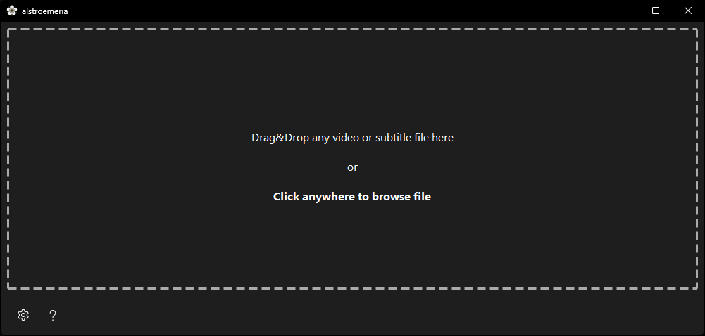
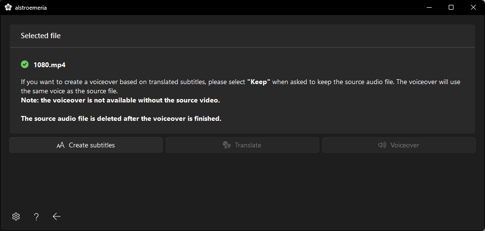

# About

**Alstroemeria** lets you create and translate subtitles for any video, complete with voiceover generation.  
Powered by **Faster-Whisper**, **Argos Translate**, **Coqui TTS**, and **QFluentWidgets**.

This project was originally developed for a family member and is provided *as is*.  
It may not receive regular updates, new features, or bug fixes.

---

## Features

- **Subtitle creation** – Generate subtitles for any video using Faster-Whisper, with multiple model choices.  
- **Subtitle translation** – Translate subtitles into any language supported by Argos Translate.  
- **Voiceover generation** – Turn subtitles into voiceovers with Coqui TTS.  
- **GPU acceleration** – Optimized for NVIDIA GPUs, with CPU fallback for smaller models.  
- **Offline** – Works fully locally once models are downloaded.  

---

## Getting Started

### Prerequisites
- [Python 3.12](https://www.python.org/downloads/release/python-3129/)  
- [Git](https://git-scm.com/downloads)  
- Windows  

### Installation

1. Clone the repository:
   ```bash
   git clone https://github.com/icosane/alstroemeria.git
   ```
   Or download the latest `.zip` release and extract it.

2. Create a virtual environment:
   ```bash
   python -m venv .venv
   ```

3. Activate it:
   ```bash
   .\Scripts\activate
   ```

4. Install dependencies:
   ```bash
   pip install -r requirements.txt
   ```

Alternatively, open the folder in [Visual Studio Code](https://code.visualstudio.com/download) or [VSCodium](https://github.com/VSCodium/vscodium/releases), install the Python extension, then press `Ctrl+Shift+P` → **Python: Create Environment** → `.venv` → select `requirements.txt`.

---

### Build Executable (.exe)

1. Install PyInstaller:
   ```bash
   pip install pyinstaller
   ```
2. Build:
   ```bash
   pyinstaller build.spec
   ```
   *(The `build.spec` file is included in the repository.)*
---

## Usage

- The **first launch** may take longer while directories and environment variables are created. Later launches will be faster.  
- Drag & drop any **video** or **.srt** file into the window.  
- You can then:
  - Create subtitles  
  - Translate them  
  - Generate a voiceover (video file required, since it uses the original audio)  

⚙️ Before starting, configure your preferred Whisper model and translation languages in **Settings**.

---

## Acknowledgments

- [Faster-Whisper](https://github.com/SYSTRAN/faster-whisper)  
- [QFluentWidgets](https://github.com/zhiyiYo/PyQt-Fluent-Widgets)  
- [Argos Translate](https://github.com/argosopentech/argos-translate)  
- [Coqui TTS](https://github.com/idiap/coqui-ai-TTS)  
- [FFmpeg](https://ffmpeg.org/)  
- [PyQt6](https://pypi.org/project/PyQt6/)  
- [nvidia-cublas](https://pypi.org/project/nvidia-cublas-cu12/)  
- [nvidia-cuda-runtime](https://pypi.org/project/nvidia-cuda-runtime-cu12/)  
- [nvidia-cudnn](https://pypi.org/project/nvidia-cudnn-cu12/)  
- [pywinrt](https://github.com/pywinrt/pywinrt)  
- [psutil](https://github.com/giampaolo/psutil)  
- [onnxruntime](https://github.com/microsoft/onnxruntime)  
- [PyTorch](https://pytorch.org/)  
- [pydub](https://github.com/jiaaro/pydub)  
- [langdetect](https://github.com/Mimino666/langdetect)  
- [PyInstaller](https://pyinstaller.org/)  
- [Manuka icons](https://www.flaticon.com/free-icon/myrtus_8868385) – created by Paul J. (Flaticon)

   **This software contains source code provided by NVIDIA Corporation.**
---

## Screenshots

<div style="display: flex; flex-direction: column;">
    
    
    
</div>  

---

## License

This project is licensed under the **GNU General Public License v3.0 (GPLv3)**.  
See the [LICENSE](./LICENSE) file for details.
