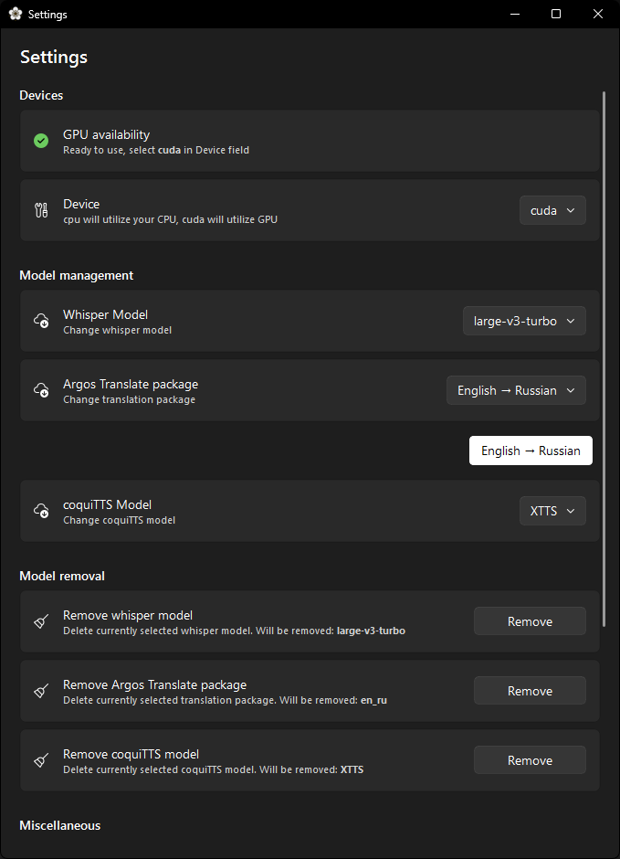

# About

Effortlessly create and translate subtitles for any video, complete with voiceover capabilities. Powered by Faster-Whisper, Argos Translate, Coqui TTS, and QFluentWidgets.

It was developed specifically for a family member, and as such, it is provided as-is. Please note that the project may not receive any new features or fixes in the future.

## Features

- **Subtitle creation**: Generate subtitles for any video using faster-whisper, with a selection of speech recognition models to choose from.
- **Subtitle translation**: Translate subtitles into any language supported by Argos Translate
- **Voice over**: Transform subtitles into voiceovers with Coqui TTS
- **GPU support**: Optimized for NVIDIA GPUs, with the option to run on any CPU for smaller models.
- **Fully Local**: Operates entirely offline after downloading the necessary models.


## Getting Started

### Prerequisites

1) [Python 3.12](https://www.python.org/downloads/release/python-3129/)
2) [Git](https://git-scm.com/downloads)
3) Windows

### Installation

1. Clone the repository:
   ```bash
   git clone https://github.com/icosane/alstroemeria.git
   ```
   or download the latest release (the .zip file) and extract its contents to your computer.

2. Navigate to the folder and create a virtual environment:
    ```bash
    python -m venv .
    ```
3. Activate the virtual environment:
    ```
    .\\Scripts\\activate
    ```
4. Install the requirements from the file: 
    ```
    pip install -r requirements.txt
    ```

Or open the extracted folder in [Visual Studio Code](https://code.visualstudio.com/download) / [VSCodium](https://github.com/VSCodium/vscodium/releases), install Python extension, then press ```Ctrl+Shift+P```, type ```Python: Create Environment```, select ```.venv```, use ```requirements.txt``` and wait for it to finish.

### Building .EXE
1. Install PyInstaller in your .venv:
```pip install pyinstaller```
2. Run ```pyinstaller build.spec```


## Usage

Simply drag and drop any video or .srt file into the window.  You will then have the option to create subtitles, translate them, and generate a voiceover based on the subtitle file. Note that if you just drop an .srt file, the voiceover option will not be available. This is because it uses the audio from the video file. Before using, please select your preferred Whisper model and translation languages in the Settings.

## Acknowledgments

- [faster-whisper](https://github.com/SYSTRAN/faster-whisper)
- [QFluentWidgets](https://github.com/zhiyiYo/PyQt-Fluent-Widgets)
- [Argos Translate](https://github.com/argosopentech/argos-translate)
- [Coqui TTS](https://github.com/idiap/coqui-ai-TTS)
- [FFMpeg](https://ffmpeg.org/)
- [PyQt6](https://pypi.org/project/PyQt6/)
- [nvidia-cublas](https://pypi.org/project/nvidia-cublas-cu12/)
- [nvidia-cuda-runtime](https://pypi.org/project/nvidia-cuda-runtime-cu12/)
- [nvidia-cudnn](https://pypi.org/project/nvidia-cudnn-cu12/)
- [pywinrt](https://github.com/pywinrt/pywinrt)
- [psutil](https://github.com/giampaolo/psutil)
- [onnxruntime](https://github.com/microsoft/onnxruntime)
- [PyTorch](https://pytorch.org/)
- [pydub](https://github.com/jiaaro/pydub)
- [langdetect](https://github.com/Mimino666/langdetect)
- [PyInstaller](https://pyinstaller.org/)
- [manuka icons](https://www.flaticon.com/free-icon/myrtus_8868385) - Manuka icons created by Paul J. - Flaticon

## Screenshots
<div style="display: flex; flex-direction: column;">
    
    
    
</div>